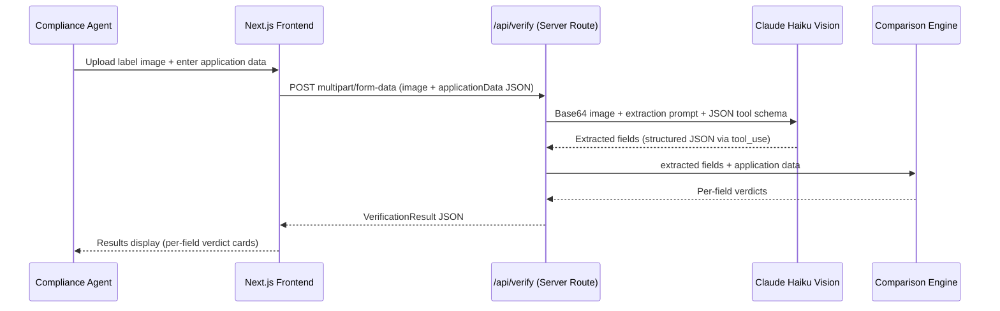

# feat: Build AI-Powered Alcohol Label Verification App

## Summary

Build a greenfield web prototype that helps TTB compliance agents verify that alcohol label artwork matches submitted application data. An agent uploads a label image and enters (or imports) the application form values and field applicability; the tool sends the image to a vision model, extracts the seven TTB verification fields, compares applicable fields deterministically against the application data, and returns a per-field match/needs-review/mismatch/not-applicable verdict. Batch upload of 200–300 labels is supported through durable server-side jobs with bounded parallel processing and a live progress indicator. The application deploys to Render as a Next.js web service.

---

## Problem Frame

TTB compliance agents review ~150,000 label applications per year across a team of 47 agents. The dominant cost is rote data-entry verification: confirming that what is on the label image matches what is in the application form. The goal of this prototype is to automate that matching step so agents can focus on judgment-intensive work.

**Hard constraints from the README:**
- Interactive single-label results in ≤5 seconds (failed vendor pilot ran 30–40s; agents abandoned it)
- Government warning must match the canonical warning exactly, use an all-caps bold `GOVERNMENT WARNING:` prefix, and remain legible/prominent rather than tiny or buried
- Brand-name matching must tolerate capitalization and minor punctuation differences rather than hard-failing obvious equivalents (Dave's `STONE'S THROW` vs `Stone's Throw` case)
- UI must be usable by non-technical staff — "my mother could figure it out" is the benchmark
- Batch upload for 200–300 labels at once
- Deployed public URL as a hard deliverable

---

## Requirements

Derived from README stakeholder interviews and TTB label requirements:

| ID | Requirement |
|----|-------------|
| R1 | Single-label flow: upload image + enter application data → per-field verdict |
| R2 | Seven fields represented: brand name, class/type, ABV, net contents, bottler name/address, country of origin, government warning. Applicability is determined from the submitted beverage type and application requirements; the government warning is always applicable |
| R3 | Government warning: require both label text and submitted application text to equal the canonical government warning; detect any wording, whitespace, capitalization, or prefix deviation, confidently non-bold prefix, or confidently illegible/inadequately prominent warning as a mismatch; uncertain visual formatting or prominence becomes needs-review |
| R4 | Applicable brand and text fields produce match / needs-review / mismatch outcomes; conditional fields may instead be not-applicable |
| R5 | Interactive single-label verification returns a result in ≤5 seconds under normal operating conditions; each batch item targets ≤5 seconds of active processing once claimed, excluding queue wait |
| R6 | Batch upload: 1–300 labels with durable server-side processing, per-item progress, and results that survive browser navigation or closure |
| R7 | UI accessible to non-technical users; clean, obvious, no hidden actions |
| R8 | Source code repo containing all source code, README setup/run instructions, and brief documentation of approach, tools, assumptions, trade-offs, and limitations; plus a working deployed public URL |
| R9 | Image uploads accept JPEG, PNG, or WebP up to 5 MB compressed and 25 megapixels decoded, validated server-side |
| R10 | Batch CSV uploads are UTF-8, at most 1 MB, structurally valid, and contain 1–300 rows |
| R11 | Batch upload uses a temporary draft with individual image transfers, then atomically creates a visible job only after every required file is durable |
| R12 | Batch execution automatically retries transient failures, adapts to provider rate limits, and deletes job data at the exact configured expiry |

---

## Scope Boundaries

**In scope:**
- Single-label verification flow (image + manual form entry)
- Batch upload via CSV (application data) + multiple image files, with resumable progress through a job link
- Batch results CSV export during the job retention window
- All seven TTB verification fields with per-field verdicts, including not-applicable for conditional requirements
- Deployed Render web service
- Basic error handling (extraction failure → informative message, not crash)
- JPEG, PNG, and WebP image uploads up to 5 MB compressed and 25 megapixels decoded
- UTF-8 batch CSV uploads up to 1 MB

### Deferred for Later
- User authentication and session management
- Long-term storage or audit logs beyond the batch-job retention window
- COLA system integration
- PDF or multi-page document support
- Long-term archival or user-managed deletion of batch results

### Deferred to Follow-Up Work
- Streaming extraction response to show partial results before the full API call completes
- Image preprocessing (sharpening, rotation correction) for degraded/glared photos
- Model-tier fallback logic beyond the `MODEL_ID` env var

### Outside This Product's Identity
- Production FedRAMP / FISMA compliance
- PII handling and federal data retention policy
- Local/offline OCR fallback for air-gapped deployments (Marcus's firewall concern; the one required outbound dependency — `api.anthropic.com:443` — should be documented in the README, not worked around in code for this prototype)

---

## Key Technical Decisions

**1. Next.js (App Router) deployed to Render as a persistent web service**
Single repository, single deployable. API routes handle the Claude API call server-side (keeping the API key off the client). Render's web service tier runs Next.js as a persistent Node process — no serverless cold-start or timeout constraints. Chosen over a decoupled SPA + API because the prototype has no reason to split surfaces.

**2. Claude Haiku (`claude-haiku-4-5-20251001`) for vision extraction**
Haiku processes a typical label image in 1–2 seconds. That headroom supports the ≤5s interactive single-label requirement. Sonnet improves accuracy on degraded images but adds 2–4s latency and ~5× cost; Haiku is the right default. The model is swappable via `MODEL_ID` environment variable with no code change.

**3. Structured extraction + deterministic comparison in code**
The Claude call extracts fields into a typed JSON schema via tool use. Comparison logic is pure TypeScript — not a second LLM call. This keeps comparison fast (<1ms), deterministic, explainable, and independently testable. The LLM's job is OCR + field parsing; the code's job is issuing verdicts.

Comparison uses explicit field-specific rules, not a generic similarity score. Canonically equivalent values can match, clearly different values mismatch, and ambiguous brand, class/type, or bottler/address comparisons become `needs-review` for human judgment.

**4. Four-state verdict per field: `match` / `needs-review` / `mismatch` / `not-applicable`**
`needs-review` covers cases that are probably fine but warrant human confirmation: minor capitalization differences, common abbreviations, minor punctuation variants. This directly addresses Dave's concern — agents see a yellow "needs review" badge rather than a red "mismatch" on obvious equivalents.

`not-applicable` covers verification fields that are not required for the submitted beverage type and application. The application supplies applicability for each field because the README says requirements vary among beer, wine, and distilled spirits. The government warning is the sole universal exception: it is mandatory for every alcohol beverage and can never be marked not applicable.

**5. Government warning: canonical text + visual compliance validation**
Compare both the extracted label warning and the submitted application warning verbatim against a canonical government warning constant maintained by the application, including capitalization and whitespace. Neither an incorrect application value nor matching-but-incorrect label/application text can pass. Separately extract whether the `GOVERNMENT WARNING:` prefix is bold and whether the complete warning is legible and adequately prominent rather than tiny or buried. A text deviation, confidently non-bold prefix, or confidently illegible/inadequately prominent warning is a `mismatch`. Uncertain boldness, legibility, or prominence is `needs-review` only when both text values are canonical.

**6. ABV: numeric extraction + tolerance comparison**
Extract the numeric ABV value from both label and application (e.g., "45% Alc./Vol." → 45.0, "90 Proof" → 45.0 via proof÷2). Compare within ±0.1% tolerance. Format differences that map to the same numeric value → `match`.

**7. Durable server-side batch jobs**
Finalizing a fully uploaded draft creates an unguessable job ID and stores its metadata, input files, progress, and results on the server. A background processor claims pending items with bounded concurrency (default 4), retries transient failures, and resumes unfinished work after a service restart. The browser polls by job ID and can safely navigate away or close; reopening the job URL restores current progress and completed results. Jobs and uploaded images expire after 24 hours to avoid becoming an audit archive.

A batch contains 1–300 CSV rows and exactly one corresponding image per row. Matching uses the filename basename only, discarding any client-supplied directory path, and is case-insensitive. Basenames must be unique under case-insensitive comparison within both the CSV and uploaded image set, so case-only collisions or duplicate names from different folders are rejected. Both client and server enforce the limit and uniqueness before durable job creation; oversized or ambiguous batches are rejected rather than truncated or guessed.

With authentication out of scope, possession of the unguessable job URL grants access until expiry. After upload, the UI prominently shows a copyable job link and stores the job ID plus a non-sensitive display label in browser-local recent jobs. Recent jobs are a convenience for that browser only, not an account-level history.

The 24-hour retention period is a documented prototype assumption rather than a README requirement. The batch form discloses it before submission, and the job page displays the exact expiration date and time.

Because 300 images at the 5 MB limit could total roughly 1.5 GB, a batch is not sent in one HTTP request. The server first creates a temporary, unguessable draft. The client uploads the validated CSV and images individually, with visible aggregate progress, then requests finalization. Finalization transactionally verifies that every manifest image is durable and only then creates the visible batch job. Drafts are not jobs, do not appear in recent-job history, and expire automatically if abandoned.

Closing or navigating away during file transfer can interrupt unfinished draft uploads. The UI warns about this while transfer is active. Once finalization succeeds and the job URL is shown, browser closure cannot interrupt processing.

**8. Image upload contract**
Single and batch flows accept JPEG, PNG, and WebP images up to 5 MB in uploaded bytes and 25 megapixels when decoded. The server validates the actual file signature and reads image dimensions with a bounded metadata parser before model submission, rather than trusting the extension or browser-provided MIME type or fully decoding untrusted image data. HEIC, TIFF, renamed non-images, compressed images exceeding 5 MB, and images exceeding 25 megapixels are rejected with a plain-language message identifying the supported formats and limits.

**9. Batch CSV contract**
The batch manifest must be UTF-8 CSV, no larger than 1 MB, with a valid header and 1–300 data rows. Parsing uses a CSV library with strict quoting and column validation rather than manual string splitting. Header names are trimmed and matched case-insensitively, column order is irrelevant, and values are resolved by normalized header name. Canonical exported names remain lowercase snake_case. Headers that collide after normalization, such as `ABV` and ` abv `, are rejected as duplicates.

All canonical value columns are required as headers, including `beverage_type`; a field value may be blank only when its corresponding applicability column is false. The six non-warning applicability columns are optional and default to true. Unknown columns are ignored so exports from other systems remain usable. When present, applicability values accept `true/false`, `yes/no`, or `1/0` case-insensitively. Blank or any other applicability value is invalid. Invalid UTF-8, malformed quoting, NUL bytes or other binary content, duplicate normalized headers, and missing required columns are rejected before draft finalization.

Each text value is limited to 2,000 characters after CSV parsing, and each basename is limited to 255 characters. These limits apply on both client and server.

**10. Overall result and lifecycle rules**
An item's overall status is the worst applicable field outcome: any `mismatch` produces overall `mismatch`; otherwise any `needs-review` produces overall `needs-review`; otherwise the item is `match`. `not-applicable` fields do not affect the overall status.

Transient provider failures, timeouts, and 5xx responses are retried automatically up to two times with exponential backoff. Validation failures and authentication/authorization failures are not retried. A failed item can be manually retried afterward. Batch concurrency starts at `BATCH_CONCURRENCY=4` and is reduced when the provider returns rate-limit responses; work ramps back toward the configured ceiling after successful processing.

At the exact job expiry, uploaded images, stored results, and job metadata are deleted. Cleanup runs periodically and at service startup. A non-sensitive hashed tombstone is retained briefly only to distinguish an expired issued ID (`410 Gone`) from a never-issued or unknown ID (`404 Not Found`); it contains no filenames, application values, images, or results.

---

## System-Wide Impact

- **Compliance agents** (primary users): Sarah, Dave, Jenny and their colleagues. UI must accommodate low-to-moderate tech comfort; generous labeling, large click targets, plain English throughout.
- **IT / Marcus**: Render hosting, single outbound dependency (`api.anthropic.com:443`). The README must document this firewall requirement explicitly so any future production pilot doesn't fail the way the scanning vendor pilot did.
- **No shared infrastructure changes** — standalone prototype with no COLA integration.

---

## High-Level Technical Design

*This illustrates the intended approach and is directional guidance for review, not implementation specification. The implementing agent should treat it as context, not code to reproduce.*



**Comparison engine decision matrix (per field type):**

| Field | Normalization | `match` | `needs-review` | `mismatch` |
|---|---|---|---|---|
| Government warning | Compare label and submitted text to canonical warning; inspect prefix weight, legibility, and prominence | Both texts canonical, prefix confidently bold, warning confidently legible/prominent | Both texts canonical but boldness, legibility, or prominence is uncertain | Any canonical text deviation, missing prefix, confidently non-bold prefix, or confidently illegible/inadequately prominent warning |
| Brand name | Compare exact value, then canonicalize case/punctuation to identify likely equivalence | Exact source strings | Case/punctuation-only variant or other plausible near-match requiring judgment | Clearly different tokens |
| ABV | Extract numeric value (proof÷2) | Within ±0.1% | — | >±0.1% |
| Net contents | Normalize units (750mL = 750 ml) | Same normalized value | — | Different value |
| Class/type | Lowercase, strip extra spaces | Exact | Minor word-order difference | Different |
| Bottler name/address | Lowercase, normalize whitespace | Exact | Partial match / common abbrev | Different |
| Country of origin | Lowercase | Exact | Common abbreviation (e.g., USA/United States) | Different |

For any field except the government warning, `application.applicability[field] === false` short-circuits comparison and returns `not-applicable`. The application must provide beverage type and field applicability rather than asking the vision model to infer legal requirements. The government warning is always applicable. An extracted value may still be retained for display, but its presence or absence does not alter a not-applicable verdict.

---

## Output Structure

```
app/
  api/
    verify/
      route.ts
  page.tsx
  layout.tsx
  globals.css
components/
  LabelUploadForm.tsx
  ApplicationDataForm.tsx
  ResultsDisplay.tsx
  FieldVerdictCard.tsx
  BatchUploadForm.tsx
  BatchProgress.tsx
  BatchResults.tsx
app/
  batch/
    [jobId]/
      page.tsx
  api/
    batch/
      drafts/
        route.ts
        [draftId]/
          manifest/
            route.ts
          images/
            route.ts
          finalize/
            route.ts
      [jobId]/
        route.ts
        export/
          route.ts
lib/
  extract.ts
  compare.ts
  government-warning.ts
  batch-store.ts
  batch-worker.ts
  batch-cleanup.ts
  csv.ts
  image-validation.ts
  types.ts
tests/
  compare.test.ts
  government-warning.test.ts
.env.example
render.yaml
next.config.ts
tailwind.config.ts
package.json
tsconfig.json
```

---

## Implementation Units

### U1. Project Scaffold and Configuration

**Goal:** Establish a working Next.js App Router project with TypeScript, Tailwind CSS, Anthropic SDK dependency, and Render deployment configuration.

**Requirements:** R8

**Dependencies:** None

**Files:**
- `package.json`
- `next.config.ts`
- `tsconfig.json`
- `tailwind.config.ts`
- `app/layout.tsx`
- `app/globals.css`
- `render.yaml`
- `.env.example`
- `lib/types.ts`

**Approach:** Initialize with `create-next-app` using App Router + TypeScript + Tailwind. Install `@anthropic-ai/sdk`. `render.yaml` declares a web service: build command `npm install && npm run build`, start command `npm start`, `NODE_ENV=production`. `.env.example` documents `ANTHROPIC_API_KEY`, `MODEL_ID` (default `claude-haiku-4-5-20251001`), `DATA_DIR`, `BATCH_CONCURRENCY`, `BATCH_RETENTION_HOURS`, and `DRAFT_RETENTION_HOURS`. `lib/types.ts` defines shared type contracts: `ExtractedFields` (including `government_warning_prefix_bold`, `government_warning_legible`, and `government_warning_prominent` as `true | false | null`), `ApplicationData` (beverage type, values, and applicability map with government warning fixed true), `FieldVerdict` (`'match' | 'needs-review' | 'mismatch' | 'not-applicable'`), `VerificationResult` (map of field name to verdict + extracted/submitted values), and overall batch item status.

**Test expectation:** none — pure scaffolding/config

**Verification:** `npm run build` succeeds; `npm run dev` serves the app at localhost; `.env.example` is present with all required variables documented; `render.yaml` is present.

---

### U2. Field Comparison Engine

**Goal:** Implement deterministic per-field comparison logic converting extracted fields + application data into per-field verdicts.

**Requirements:** R2, R3, R4

**Dependencies:** U1

**Files:**
- `lib/compare.ts`
- `lib/government-warning.ts`
- `tests/compare.test.ts`
- `tests/government-warning.test.ts`

**Approach:** Pure functions with no I/O. `lib/government-warning.ts` validates that the extracted and submitted warnings begin with the literal `GOVERNMENT WARNING:` token in exact case and compares both complete strings verbatim against the canonical warning constant without whitespace normalization. A deviation in either text or any `false` visual compliance flag produces `mismatch`; a `null` boldness, legibility, or prominence flag produces `needs-review` only when both texts are canonical. `lib/compare.ts` exports `compareFields(extracted: ExtractedFields, application: ApplicationData): VerificationResult`. It returns `not-applicable` for any non-warning field explicitly marked inapplicable for the submitted beverage/application; the warning always dispatches to canonical validation. ABV comparison extracts numeric values via regex before comparing. Brand comparison returns `match` only for exact source strings; case/punctuation-only variants and other plausible equivalents return `needs-review`, preserving human judgment.

**Execution note:** Implement test-first — the comparison rules are the core correctness surface and the README gives explicit pass/fail examples to encode as tests before writing the logic.

**Test scenarios:**
- Government warning matching submitted application but not canonical warning → `mismatch`
- Government warning matching canonical text with compliant visual evidence → `match`
- Government warning with `Government Warning` (title case prefix) → `mismatch`
- Government warning with canonical text and confidently non-bold prefix → `mismatch`
- Government warning with canonical text and uncertain prefix boldness → `needs-review`
- Government warning with canonical label text but an incorrect submitted application value → `mismatch`
- Government warning with canonical text but confidently tiny, buried, or illegible presentation → `mismatch`
- Government warning with canonical text but uncertain legibility/prominence → `needs-review`
- Government warning with any extra interior whitespace on either side → `mismatch`
- Government warning missing `GOVERNMENT WARNING:` prefix entirely → `mismatch`
- Government warning with correct prefix but wrong body text → `mismatch`
- Brand `STONE'S THROW` (extracted) vs `Stone's Throw` (application) → `needs-review`
- Brand `OLD TOM DISTILLERY` vs `OLD TOM DISTILLERY` → `match`
- Brand `Old Tom` vs `New Tom` → `mismatch`
- Ambiguous brand, class/type, or bottler/address near-match → `needs-review` using field-specific rules, not a generic similarity threshold
- ABV `45% Alc./Vol.` vs `45%` → `match`
- ABV `90 Proof` (= 45%) vs `45%` → `match`
- ABV `45%` vs `46%` → `mismatch`
- Net contents `750 mL` vs `750ml` → `match`
- Country of origin `United States` vs `USA` → `needs-review`
- All null extracted fields with all fields applicable → `mismatch` for each field
- Domestic product with country of origin marked inapplicable → country verdict is `not-applicable`, regardless of extracted value
- ABV-exempt beverage with ABV marked inapplicable → ABV verdict is `not-applicable`
- Any non-warning field marked inapplicable for the submitted beverage/application → `not-applicable`
- Government warning marked inapplicable in input → validation error; warning remains mandatory
- Mixed result: 5 match, 1 needs-review, 1 mismatch → `VerificationResult` reflects all three states correctly

**Verification:** All test scenarios pass; comparison functions are pure (no side effects, no API calls); `npm test` runs cleanly.

---

### U3. Claude Vision Extraction API Route

**Goal:** Implement the `/api/verify` Next.js route that accepts a label image and returns a full `VerificationResult` via Claude Haiku vision extraction + comparison engine.

**Requirements:** R1, R2, R5, R9

**Dependencies:** U1, U2

**Files:**
- `app/api/verify/route.ts`
- `lib/extract.ts`

**Approach:** `route.ts` accepts `multipart/form-data` with `image` (File) and `applicationData` (JSON string). It validates that both are present, the uploaded bytes are at most 5 MB, the file signature identifies JPEG, PNG, or WebP, and dimensions do not exceed 25 megapixels; it does not trust the filename extension or supplied MIME type. It also validates beverage type/applicability input and rejects any attempt to mark the government warning inapplicable. Dimension inspection reads bounded metadata without fully decoding the image. Invalid input returns 400 with a user-readable message. `lib/extract.ts` calls the Anthropic SDK with the image as a base64-encoded vision message and uses the `tools` parameter with a typed JSON schema matching `ExtractedFields` to force structured output, including nullable booleans for whether the warning prefix is visibly bold and whether the full warning is legible and adequately prominent. Reads the `tool_use` content block from the response to get the parsed JSON. After extraction, calls `compareFields` from U2 and returns the full `VerificationResult`. Target: <4s for the Claude call, leaving 1s for parsing and comparison.

**Patterns to follow:** Anthropic SDK `tools` parameter with `input_schema` for structured output; `content[].type === 'tool_use'` to extract the payload.

**Test scenarios:**
- Valid JPEG of a label with all seven fields visible → all `ExtractedFields` non-null, `compareFields` called, `VerificationResult` returned
- Image with no government warning → `government_warning` field null or empty → comparison returns `mismatch` for that field
- Image file exceeds 5MB → API returns 400 with user-readable message
- Image dimensions exceed 25 megapixels despite compressed bytes being under 5 MB → API returns 400 without model submission
- JPEG, PNG, and WebP signatures → accepted regardless of filename casing
- HEIC, TIFF, or a renamed non-image file → API returns 400 with supported-format guidance
- `applicationData` is malformed JSON → API returns 400
- `ANTHROPIC_API_KEY` missing → API returns 500 with generic error (no credentials in response body)
- Deployed route latency is measured end-to-end over a representative set of normal label images; record p50 and p95

**Verification:** API returns a valid `VerificationResult` for a test image; local benchmarks are diagnostic only; deployed end-to-end p50 and p95 are recorded, with acceptance requiring p95 ≤5 seconds under normal load; error cases return appropriate HTTP status codes.

---

### U4. Single-Label Verification UI

**Goal:** Implement the main page UI: label image upload, application data entry form, submit action, and results display.

**Requirements:** R1, R5, R7

**Dependencies:** U1, U3

**Files:**
- `app/page.tsx`
- `components/LabelUploadForm.tsx`
- `components/ApplicationDataForm.tsx`
- `components/ResultsDisplay.tsx`
- `components/FieldVerdictCard.tsx`

**Approach:** `page.tsx` manages page state: `idle → submitting → results | error`. `LabelUploadForm` handles drag-and-drop + file picker for the label image; shows a thumbnail preview after selection. `ApplicationDataForm` first asks for beverage type, then shows clearly labeled text inputs for each of the seven fields with generous placeholder text (e.g., "e.g. OLD TOM DISTILLERY"). Every field except the government warning includes an obvious "Required on this application" control so application-specific requirements can be represented without embedding incomplete beverage law in the prototype. Turning it off disables and clears that value. The government warning is visibly marked "Always required" and cannot be disabled. On submit, POST to `/api/verify`; show a loading state ("Analyzing label...") while awaiting the response. `ResultsDisplay` renders one `FieldVerdictCard` per field: green check for match, yellow caution for needs-review, red X for mismatch, and neutral gray for not-applicable, with extracted value and submitted value shown side-by-side where relevant. The government warning card also explains canonical text, bold-prefix, legibility, and prominence findings. Keep all UI text plain English — no TTB jargon, no technical terms.

**Test scenarios:**
- Upload a valid image + fill all applicable fields → submit → results rendered within 5s
- Submit with no image selected → inline validation message on the image field, form not submitted
- Submit with image but blank applicable fields → per-field validation messages, form not submitted
- Mark country of origin not applicable → its input is disabled and submission returns a neutral not-applicable result
- Mark any non-warning field not applicable → its input is disabled and submission returns a neutral not-applicable result
- Government warning is visibly always required and cannot be marked not applicable
- API returns a 500 → error message displayed inline ("Something went wrong — please try again"), not a blank or crashed screen
- `needs-review` verdict shows both the extracted value and the submitted value for human comparison
- Image thumbnail preview appears immediately after file selection (before submit)
- Form resets cleanly after clicking "Verify another label"

**Verification:** All seven fields render verdicts after a successful submission; error states display gracefully; a non-technical tester can complete the flow without instructions.

---

### U5. Durable Batch Upload Flow

**Goal:** Implement batch upload of 200–300 labels as a durable server-side job with bounded parallel processing, a live per-item progress indicator, and results that survive browser closure.

**Requirements:** R6, R7, R9, R10, R11, R12

**Dependencies:** U1, U3, U4

**Files:**
- `components/BatchUploadForm.tsx`
- `components/BatchProgress.tsx`
- `components/BatchResults.tsx`
- `app/page.tsx` (add tab/mode toggle for single vs. batch)
- `app/batch/[jobId]/page.tsx`
- `app/api/batch/drafts/route.ts`
- `app/api/batch/drafts/[draftId]/manifest/route.ts`
- `app/api/batch/drafts/[draftId]/images/route.ts`
- `app/api/batch/drafts/[draftId]/finalize/route.ts`
- `app/api/batch/[jobId]/route.ts`
- `app/api/batch/[jobId]/export/route.ts`
- `lib/batch-store.ts`
- `lib/batch-worker.ts`
- `lib/batch-cleanup.ts`
- `lib/csv.ts`
- `lib/image-validation.ts`

**Approach:** `BatchUploadForm` accepts a UTF-8 CSV file no larger than 1 MB with 1–300 rows and exactly one corresponding JPEG, PNG, or WebP image up to 5 MB compressed and 25 megapixels decoded per row. Canonical value columns are `filename, beverage_type, brand_name, class_type, abv, net_contents, bottler, country, government_warning`. Applicability columns are `brand_name_applicable, class_type_applicable, abv_applicable, net_contents_applicable, bottler_applicable, country_applicable`; there is no government-warning applicability column because that field is mandatory. CSV header matching trims surrounding whitespace and is case-insensitive; column order does not matter, and collisions after normalization are invalid. Unknown columns are ignored. Applicability columns are optional and default to true; accepted explicit values are `true/false`, `yes/no`, and `1/0`, case-insensitively. A false applicability value permits a blank corresponding field. A CSV library performs strict parsing and header validation. Text values are limited to 2,000 characters and basenames to 255 characters.

The client validates CSV size and structure, row/file count, case-insensitive basename uniqueness, exact case-insensitive basename coverage, image extensions, compressed sizes, and field lengths. It creates a draft with `POST /api/batch/drafts`, uploads the manifest and images through separate draft endpoints, and shows aggregate transfer progress. The server independently validates every input, stores accepted draft files durably, and records their checksums. A failed individual transfer can be retried while the draft remains active.

Batch creation is atomic at finalization: `POST /api/batch/drafts/[draftId]/finalize` verifies the full manifest, exact file coverage, signatures, dimensions, sizes, and checksums in one transaction. Any missing or invalid file rejects finalization and creates no visible job. Successful finalization commits a cryptographically random job ID, marks the draft consumed, and redirects to `/batch/[jobId]`. Abandoned drafts expire and are deleted automatically. Closing the tab before finalization may interrupt transfer; after finalization, browser state is irrelevant to processing.

A process-local worker claims pending items from SQLite and runs up to `BATCH_CONCURRENCY` extractions in parallel (default 4), using the same extraction and comparison functions as `/api/verify`. Item state transitions are `pending → processing → completed | error`; interrupted `processing` items are returned to `pending` on startup. Transient failures receive at most two automatic retries with exponential backoff. Validation and authentication failures are not retried. Provider rate-limit responses temporarily reduce effective concurrency, which recovers gradually after successful work. Permanent failures remain visible and can be manually retried from the results page.

Each claimed batch item targets ≤5 seconds of active processing under normal operating conditions. Queue wait is measured separately and is not part of that target; the plan does not imply that every item in a 200–300-label batch returns within five seconds of batch submission.

`GET /api/batch/[jobId]` returns persisted progress and results. The job page polls this endpoint while work remains, so refreshing, navigating away, or closing the browser does not interrupt processing. `BatchProgress` shows N of M processed and the estimated remaining time; `BatchResults` shows each item's summary, supports retrying failed items, and provides a CSV download for all currently completed items. Overall item status follows the worst applicable field rule. Before submission, the batch form states that the job data will be retained for 24 hours. The job page shows the exact expiration timestamp. Batch items do not carry the interactive five-second deadline; at an illustrative five seconds per item and concurrency 4, 200–300 labels take approximately 4–7 minutes, subject to provider rate limits and retries.

`GET /api/batch/[jobId]/export` generates the CSV from persisted results during the retention window. Rows preserve the original input CSV order, regardless of parallel completion order. Each row includes the source filename, overall item status, processing error if any, and for every verification field: applicability, verdict, submitted value, and extracted value. Export is available while processing so agents can recover partial results; the filename and UI make incomplete exports explicit. To prevent spreadsheet formula injection, exported text values beginning with `=`, `+`, `-`, or `@` are prefixed with a single quote.

After successful creation, the UI displays a prominent copyable job URL and records the job in `localStorage` for a "Recent batch jobs" list on the batch screen. Opening the URL is sufficient to view the job; no separate credential or authentication flow is introduced for the prototype. Expired recent-job entries are removed when detected.

**Test scenarios:**
- Upload 3 images + CSV with matching rows → durable job is created and progress reaches 3/3
- Upload transfer uses a draft and separate file requests rather than one large multipart request
- Close the tab during draft transfer → unfinished transfer stops and no visible job exists
- Complete finalization, then close the tab → server-side processing continues
- CSV references a filename not present in the image upload → validation error displayed before processing starts, no partial run
- Duplicate filename in the CSV or uploaded image set → entire submission rejected before job creation
- Case-only filename collision (`Label1.jpg` and `label1.jpg`) → rejected as a duplicate
- CSV `LABEL1.JPG` with uploaded `label1.jpg` → matched successfully while preserving original display names
- Two folder-uploaded files with the same basename → rejected as duplicates even when their directory paths differ
- CSV filename containing a directory path → matched by basename only; directory components are discarded
- Any image fails validation or durable storage → entire upload is rejected, staged files are cleaned up, and no job is created
- Any batch image is over 5 MB compressed, over 25 megapixels decoded, or is not signature-validated JPEG, PNG, or WebP → entire batch is rejected with supported-format guidance
- One image in the batch fails extraction (API error) → that item shows `error` status, remaining items continue
- Close the browser after upload, reopen the job URL → processing continued and persisted progress/results are displayed
- Reopen the app in the same browser → recent batch jobs include the submitted job and link back to it
- Open a valid job URL in another browser → job is accessible by possession of the unguessable URL
- Restart the service with items pending or processing → interrupted items resume without duplicating completed work
- Progress indicator updates visibly as server-side items complete
- UI and exported rows preserve the original input CSV order even when processing completes out of order
- Batch metrics distinguish queue wait from active processing duration; typical active processing meets the ≤5-second target
- Any mismatch yields overall mismatch; otherwise any needs-review yields overall needs-review; not-applicable fields are ignored
- Batch where one item has a mismatch → completion summary correctly counts match/needs-review/mismatch/error totals
- Download a completed batch → CSV contains one row per item with overall status and per-field applicability, verdict, submitted value, and extracted value
- Download while processing → CSV contains completed/error items only and is clearly named/marked as partial
- Retry a failed item → only that item is requeued
- Transient failure → retried at most twice with exponential backoff; validation/authentication failure → not retried
- Provider rate limit → effective concurrency decreases and later recovers without exceeding the configured ceiling
- Open an expired known job link → `410 Gone` and user-readable expired state
- Open an unknown job link → `404 Not Found`
- Batch form discloses 24-hour retention before upload; created job page shows its exact expiration timestamp
- Detect an expired recent-job entry → remove it from browser-local history
- Reach exact job expiry → metadata, results, and uploaded images are deleted by periodic/startup cleanup
- Empty CSV file → validation error, no processing begins
- CSV with 301 rows or more → rejected before job creation, with no truncation
- CSV exceeds 1 MB → rejected before image storage or job creation
- CSV contains invalid UTF-8, malformed quoting, binary content, duplicate headers, or missing required columns → rejected with a clear structural error
- CSV contains unknown columns → ignored without changing recognized values
- Header ` Brand_Name ` is accepted as `brand_name`; headers `ABV` and ` abv ` together are rejected as duplicates
- Arbitrary valid column order → parsed successfully by normalized header name; row order remains unchanged
- Applicability values `TRUE`, `no`, `1`, and `0` → accepted; blank or unknown applicability value → rejected
- Any non-warning applicability column set false → corresponding blank value accepted and result is not-applicable
- Government-warning applicability column supplied → rejected with a clear error because the warning is mandatory
- Text field over 2,000 characters or basename over 255 characters → rejected before finalization
- Exported value beginning with a spreadsheet formula character → safely prefixed with a single quote

**Verification:** Batch processing continues with no browser connected; a service restart resumes unfinished items; completed results remain available through the job URL for the configured retention window.

---

### U6. Deployment to Render

**Goal:** Deploy the Next.js app to Render as a public web service; update the README with complete setup, run, and deployment instructions.

**Requirements:** R8

**Dependencies:** U1–U5

**Files:**
- `render.yaml`
- `README.md`

**Approach:** `render.yaml` declares a paid Render web service with a persistent disk mounted at `/var/data`, `buildCommand: npm install && npm run build`, `startCommand: npm start`, and environment variables `ANTHROPIC_API_KEY` (secret), `MODEL_ID`, `DATA_DIR=/var/data`, `BATCH_CONCURRENCY=4`, `BATCH_RETENTION_HOURS=24`, and `DRAFT_RETENTION_HOURS=2`. The application starts the worker and cleanup loop with the web process; cleanup also runs once at startup. Push repo to GitHub; connect to Render; add `ANTHROPIC_API_KEY` as a secret environment variable. README documents: prerequisites (Node 20+), local development setup, required environment variables, the single outbound network dependency (`api.anthropic.com:443`), the persistent-disk requirement, draft and job retention, upload-interruption behavior, provider rate-limit effects, cloud API dependency, model swappability, the implementation approach and tools used, assumptions made, and explicit trade-offs and limitations.

**Test expectation:** none for code — deployment is verified by accessing the live URL

**Verification:** Live Render URL loads the application; representative deployed single-label tests record p50 and p95 with p95 ≤5 seconds under normal load; a finalized batch continues after closing the browser and survives a service restart; expired data is removed; `ANTHROPIC_API_KEY` does not appear in any client-side bundle or network response.

---

## Deferred Implementation Notes

- **Streaming extraction**: The Anthropic SDK supports streaming. If the interactive single-label ≤5s target proves tight on slow connections, streaming the extraction response to show partial field results would improve perceived performance.
- **Image preprocessing**: Glare, rotation, and low-light images may reduce Haiku's extraction accuracy. The `sharp` Node library can be added to the API route to normalize images before sending — worth pursuing post-prototype if accuracy is insufficient.
- **Model swapping**: `MODEL_ID` env var allows switching to `claude-sonnet-4-6` or any vision-capable model without code changes. This is the intended path if Haiku accuracy needs a boost.

---

## Alternative Approaches Considered

**Separate queue service and worker**
A dedicated queue such as Render Key Value/BullMQ plus a separate background worker would support horizontal worker scaling. Deferred because one durable SQLite-backed queue in the persistent web service is sufficient for a standalone prototype and keeps deployment comprehensible. The storage and worker interfaces should remain isolated so a dedicated queue can replace them if throughput or multi-instance scaling becomes necessary.

**Client-side sequential processing**
Processing each image from the browser would require roughly 17–25 minutes at five seconds per label and would stop if the tab closed. Rejected because that behavior makes the required 200–300-label workflow fragile and conflicts with the usability expectations in the README.

**Dedicated OCR + rule-based field extraction**
Use Tesseract (local) or a dedicated OCR service + manual field-region parsing. Rejected because: (a) Tesseract accuracy on bottle photography is poor without significant preprocessing; (b) rule-based region parsing requires label layout assumptions this prototype cannot make; (c) the vision LLM approach directly addresses Jenny's "images that aren't perfectly shot" stretch goal; (d) the firewall concern is a documentation item, not a reason to avoid cloud APIs in a prototype.
